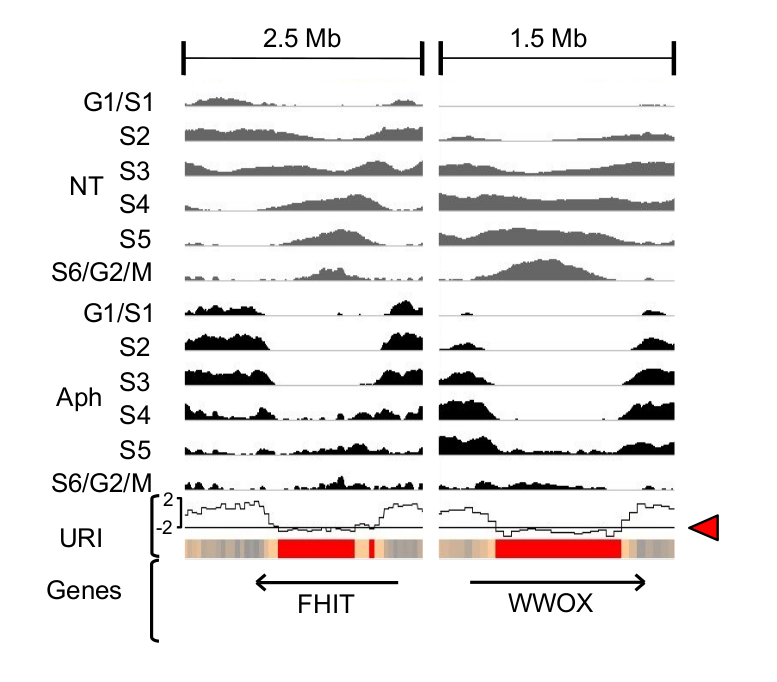
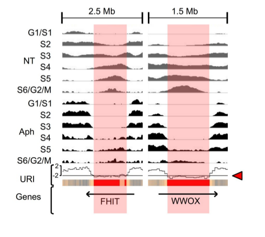

# CFS-Seq  

Analysis of Repli-Seq data under replication stress to map common fragile sites (CFSs):   
From count matrices to SDR (significantly delayed region) identification.

## Introduction :
 
This repository contains the source data and codes that were used to generate the results and plots used in the paper:  
Brison O., El-Hilali S. et al. (2019) [Transcription-Mediated Organization of the Replication Initiation Program Across Large Genes Sets Up Common Fragile Sites Genome-Wide.](https://doi.org/10.1038/s41467-019-13674-5) Nat Commun 10, 5693

We provide here the methods for analyzing Repli-seq data from cells under normal growth conditions versus replication stress conditions, aiming at identifying and characterizing SDR (significantly delayed regions), which we showed to be correlated with molecular mapping of common fragile sites (CFS) in human lymphocytes.  

All related sequencing files and processed count matrices were deposited in Gene Expression Omnibus (GEO) under accession number [GSE134709](https://www.ncbi.nlm.nih.gov/geo/query/acc.cgi?acc=GSE134709).

This repository contains R scripts and bash scripts.  
The detailed analysis methods are presented in the following sections and executable source code can be found in src/  

## Dependencies:

This methods make use of  R (>=3.4.4) packages:  
* RepliSeq (available on github [here](https://github.com/CL-CHEN-Lab/RepliSeq))
* dplyr (>= 0.8.3) 
* magrittr (>= 1.5)

We also made use of:  
* bedtools (>= v2.25.0)
* wigToBigWig (>= v4)

## Calculate Under Replication Index (URI):

As a first step, we measure the effect of DNA replication timing (obtained by Repli-Seq) under stress condition (Aph) simulated with Aphidicolin, an inhibitor of DNA polymerase II, compared to normal growth conditions (NT). We calculate an under-replication index (URI) defined as the Z score of the difference between the sum of reads per window (50kb adjacent windows, here) in cells treated (Aph) or not (NT) with Aph (=> Delta(Aph-NT)). it's calculation is implemented in the [RepliSeq package](https://github.com/CL-CHEN-Lab/RepliSeq) and the data are availeble in [inst/extdata](https://github.com/CL-CHEN-Lab/CFS-Seq/tree/master/inst/extdata)). 

The following replication profiles at FHIT and WWOX, two major CFSs, show how URI indicates the difference between the normal profile (NT) displayed in grey and the replication stress condition (Aph) displayed in black.Negative URI identified regions delayed/under-replicated upon stress. 

 

 

The R script for generating [URI_Aph1_NT1_50kb.[tab/bed/wig/bw]](https://github.com/CL-CHEN-Lab/CFS-Seq/tree/master/inst/outputs) is at [src/GenerateURI.R](https://github.com/CL-CHEN-Lab/CFS-Seq/tree/master/src/GenerateURI.R))
 

## Generate Significantly Delayed Windows (SDW) and Regions (SDR):

We then defined significantly delayed windows (SDW) as 50kb windows having an significanly low under replication index (URI <= -2). We found that these SDWs were oftently clustering together, and Genome-wide clustering of SDWs identified regions containing at least two SDWs separated by less than 250, named Significantly Delayed Regions (SDRs). The red boxes on the profiles below show the identified SDRs for FHIT (FRA3B) and WWOX (FRA16D) genes.

 

We defined SDW as the windows with 20 < mean(Aph,NT) < 40 and URI <= -2.
The results presented in the paper (Brison et al.) were obtained by proceeding as follow :

* extract all SDW -> SDW.bed
* merge adjacent SDW into SDR and those at max 250kb distance from SDR 
* merge again SDR with closest SDW (max 250kb distance) (-> SDR.bed)
* retrieve the SDW not clustering into SDR (SDW_clean.bed)

The shell script for generating [SDW.bed/SDW_clean.bed/SDR.bed](https://github.com/CL-CHEN-Lab/CFS-Seq/tree/master/inst/outputs) is at [src/Generate_SDW_SDR.sh](https://github.com/CL-CHEN-Lab/CFS-Seq/tree/master/src/Generate_SDW_SDR.sh))
 

## Authors: 

Sami EL HILALI : sami.el-hilali@curie.fr (current email: elhilali.sami@gmail.com)  

Chunlong CHEN : chunlong.chen@curie.fr

Don't hesitate to contact the authors or open an issue for any questions.

## References: 

Brison O., El-Hilali S., Azar, D., Koundrioukoff1 S., Schmidt M., Naehse-Kumpf V., Jaszczyszyn Y., Lachages A.M., Dutrillaux B., Thermes C., Debatisse M. and Chen C.L. (2019) [Transcription-Mediated Organization of the Replication Initiation Program Across Large Genes Sets Up Common Fragile Sites Genome-Wide.](https://doi.org/10.1038/s41467-019-13674-5) *Nat. Commun.* 10, 5693

